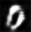
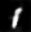
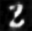
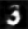
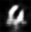
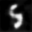
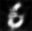
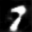
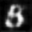
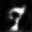

# Deep Convolutional Generative Adversarial Networks
Implementation of DCGAN in Keras.

##Used numpy, keras, matplotlib

# Methodology
1) Use the MNIST dataset
2) The Generator takes in a random noise vector of shape (,100) as input and generates an output of shape (,1,28,28)
3) The Discriminator takes in an input image of shape (,1,28,28) and gives an output of shape (,2)
4) The outputs of the discriminator are probabilities. In the output labels, 0 corresponds to generated and 1 corresponds to real.  
5) When we train the discriminator we use the correct output labels but when we train the generator we invert the labels, this ensures that the discriminator tries to maximize its prediction accuracy whereas the generator tries to minimize it

* Train a DCGAN on the MNIST dataset . Inputs are (100) dimensional noise vectors and the outputs are generated (1,28,28) images
* Samples of generated images are in `GeneratedOutputs`
* Trained generator and discriminator models in `TrainedModels`
* Generated digit samples below

|  |  |  |  | 

|  |  |  |  | 

Note: If model ttrained for longer , then images are more "crispy" .

